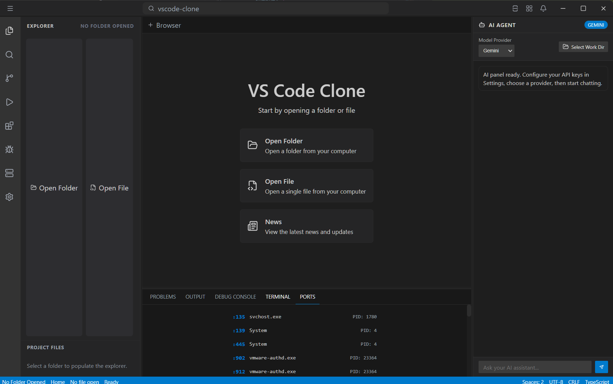
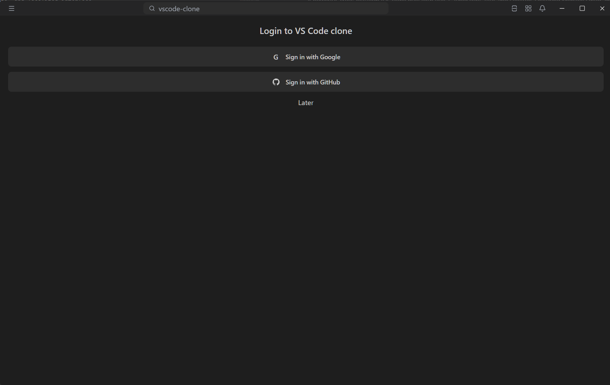

# VS Code Clone
> [!IMPORTANT]
> Currently supported on **Windows only** due to Electron + system terminal integration.
> If you use (linux/macos), you can use qemu or vmware to run windows in a virtual machine.
> <p style="color: red;">DO NOT COMMIT ANY API KEYS OR SENSITIVE INFORMATION TO THIS REPOSITORY. IF YOU DID, PLEASE REVOKE THEM IMMEDIATELY. IF YOU DID NOT YOUR API COULD BE ABUSED AND CAN LEAD TO API ACESS REVOKED.</p>

> [!NOTE]
> This project is still in development and may not be fully functional.

> [!IMPORTANT]
> this project is now deprecated. see https://www.github.com/Loulou823/eleclite-ide. it will no longer be updated so there will be security risks. if you open an issue its useless


A powerful, IDE clone built with Vue 3, TypeScript, Vite, and Electron. Featuring Monaco Editor, integrated terminal, AI assistance, and localized interface.

## Screenshots

main interface:

login screen:



---

## Features

- **Monaco Editor**: High-performance code editing with syntax highlighting and IntelliSense.
- **Integrated Terminal**: Fully functional terminal powered by xterm.js.
- **AI Integration**: Built-in AI chat supporting multiple providers (OpenAI, Anthropic, Google Gemini, Mistral).
- **Multi-language Support**: Interface translated into English, French, Russian, and Meow.
- **LibreTranslate Integration**: Real-time news translation using a local LibreTranslate instance.
- **Login System**: you can edit the login screen add your own login system.

## Tech Stack

- **Framework**: [Vue 3](https://vuejs.org/) (Composition API)
- **Runtime**: [Electron](https://www.electronjs.org/)
- **Build Tool**: [Vite](https://vitejs.dev/)
- **Icons**: [Lucide Vue Next](https://lucide.dev/)
- **Editor**: [Monaco Editor](https://microsoft.github.io/monaco-editor/)
- **Terminal**: [xterm.js](https://xtermjs.org/)

## Installation & Setup

### Prerequisites

- [Node.js](https://nodejs.org/) (Latest LTS recommended)
- [Python](https://www.python.org/) (Required for LibreTranslate)
- [LibreTranslate](https://libretranslate.com/) (`pip install libretranslate`)

### Getting Started

1. **Clone the repository**
   ```bash
   git clone https://github.com/Loulou823/vscode-clone
   cd vscode-clone
   ```

2. **Install dependencies**
   ```bash
   npm install
   ```

3. **Configure AI Providers**
   Create a `src/aiproviders.env` file and add your API keys:
   ```env
   OPENAI_API_KEY=your_key
   ANTHROPIC_API_KEY=your_key
   GEMINI_API_KEY=your_key
   MISTRAL_API_KEY=your_key
   ```

4. **Run Development Server**
   ```bash
   npm run dev
   ```

5. **Build for Production**
   ```bash
   npm run build
   ```

## Project Structure

- `electron/`: Main and preload scripts for Electron.
- `src/`: Vue.js renderer source code.
  - `components/`: UI components (TitleBar, ActivityBar, SideBar, etc.).
  - `locales/`: Translation files (en, fr, ru, meow).
  - `utils/`: Core logic (login, translation, toasts).
- `resources/`: Assets and application screenshots.
- `scripts/`: Build and maintenance scripts.

## License

This project is licensed under the MIT License - see the [release/licence.md](release/licence.md) file for details.

Copyright (c) 2025-2026 Wispia LLC
